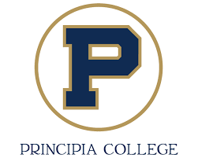

# Principia Computer Science
Jamie Bland

LinkedIn Profile: https://www.linkedin.com/in/jamie-bland-a92477230/

[//]: # (Use this area to describe the program, focused study, and experiences.  This is a secondary area where you can talk about yourself to future employers.)

[//]: # (Be sure all repositories are Public once the class has concluded, so employers can see your work.)

## Courses

- CSCI 182 - Data Structures: https://github.com/pumkinisawesome/Prin_CSCI_182/

## Special Projects
